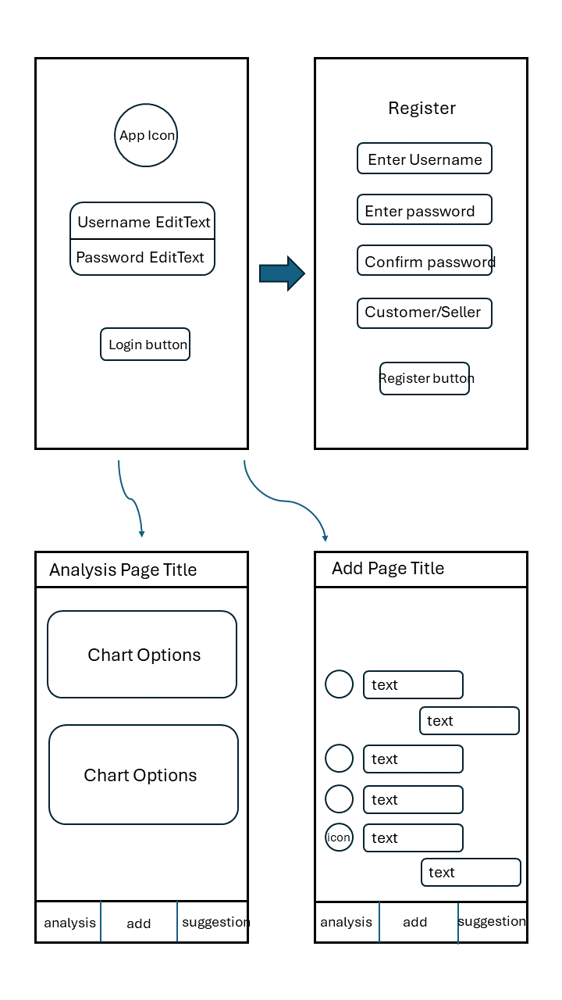

# PennyMatters: Digital Financial Recording Assistant #

Proposal of Android Application Project   
--Xinghao Cai   --Zhihao Zhou

## 1. Brief description of functions ##

The target users of our application are people who want to take record of every detailed expenditure in their lives.

Didn’t like those common apps, the recording page will just be designed like a chatting app, with a digital “financial assistant” “chatting” with the user. Users can choose or type in their expenditure category (detailed kind of food, water/electricity bill, insurance, etc.) with the exact number of money they have spent. Users can also upload a photo of their shopping receipts and its contents will automatically be extracted.

The “financial assistant” will give analysis, like reminding them of how much money they have spent this week/mouth, what’s the up and down tendency of the price of a typical item, providing a chart of price of a particular good, or something like these.

The app may also provide suggestions if user wants to buy some good, by entering the name of them and the app will give information of price of these good and the location of nearby shops in a list.

## 2. Feature list ## 

### 2.1. Essential ###
- Database connection and queries
- Page switching and scrolling
- Input box and button control 

### 2.2. Required ###
- Data visualization
- Mobile phone resources invocation (e.g. gallery)
- Optical Character Recognition (OCR) and formatting
- Basic suggestions about existed data
- Beautiful theme 

### 2.3. Optional ###
- Better response and intelligent suggestion generation of digital assistant
- Better OCR recognition effect
- Changing different themes
- More data analysis methods 

## 3. Probable wireframes ##

